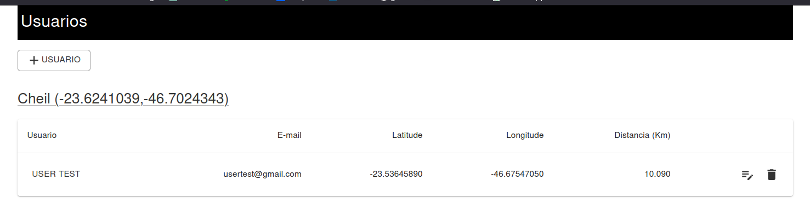
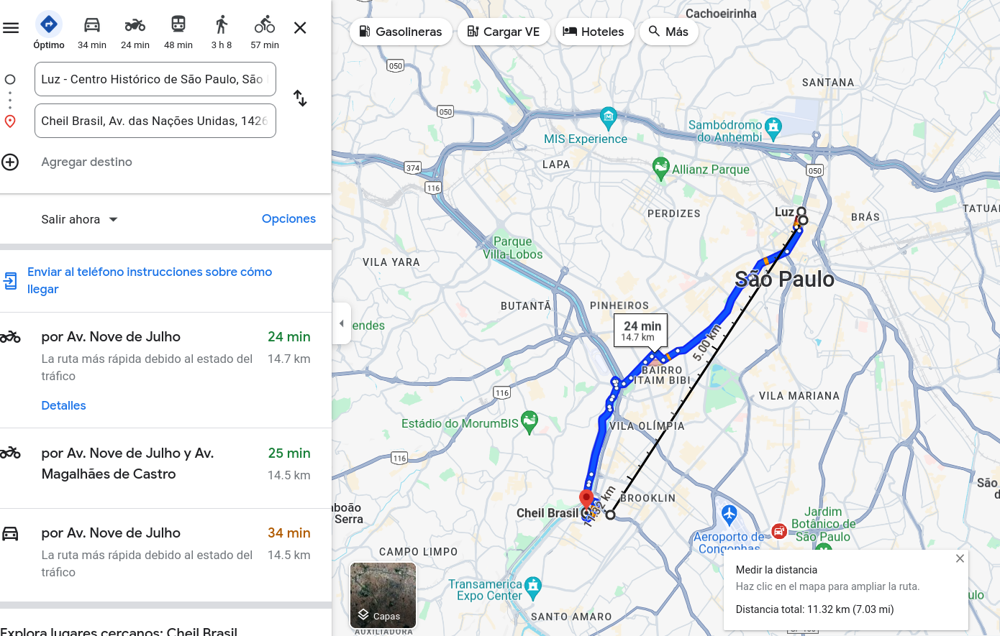

* start up
```
  git clone https://github.com/danieltorrescode/coordinates-backend
  cd coordinates-backend/
  pip install -r requirements.txt
  python manage.py runserver 0.0.0.0:8080


  git clone https://github.com/danieltorrescode/coordinates-frontend
  cd coordinates-frontend/
  npm install 
  npm run dev

  http://localhost:8000/
```


screenshots:




Google Maps 

